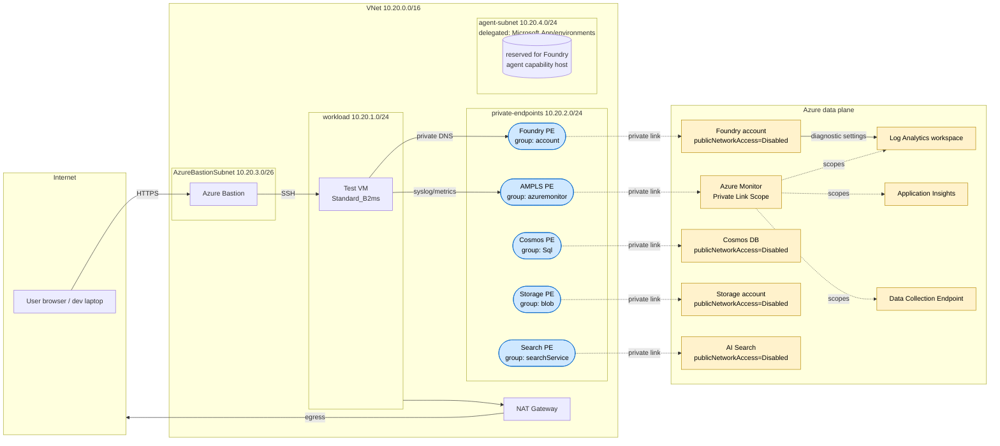

# Networking — AMPLS + Foundry Private Stack

This document describes the **network architecture** that this Bicep stack deploys:
how Foundry, its backing services, and Azure Monitor are reachable only over
private endpoints inside a single VNet, and which traffic flows through which
private DNS zone.

Resource names below use the `<env>` placeholder (whatever you set as `AZURE_ENV_NAME`).

> **Related guides**
> - [`README.md`](./README.md) — deploy + verify guide
> - [`Bastion-VM-Access.md`](./Bastion-VM-Access.md) — how to *connect to*
>   this private network from your laptop (Bastion SSH, SOCKS5 tunnel,
>   browse the Foundry portal)
> - [`Foundry-Tracing.md`](./Foundry-Tracing.md) — wiring Foundry agent
>   traces into the private App Insights and querying them from the VM

---

## 1. Network topology at a glance



---

## 2. VNet & subnets

VNet: `<env>-vnet`, address space **10.20.0.0/16**.

| Subnet | CIDR | NSG | NAT Gateway | Delegation | Purpose |
|---|---|---|---|---|---|
| `workload` | 10.20.1.0/24 | ✅ | ✅ | — | Test VM and any other clients calling Foundry/AMPLS from inside the VNet. NAT provides controlled outbound egress (e.g. `apt update`). |
| `private-endpoints` | 10.20.2.0/24 | ✅ | — | — | All private endpoints land here. |
| `AzureBastionSubnet` | 10.20.3.0/26 | ✅ | — | — | Azure Bastion (required name, required ≥/26). |
| `agent-subnet` | 10.20.4.0/24 | ✅ | — | `Microsoft.App/environments` | Reserved for Foundry **Standard Agent Setup** (`networkInjections` + capability host). Empty until `ENABLE_AGENTS=true`. |

---

## 3. Private Endpoints

All PEs sit in `private-endpoints` subnet (10.20.2.0/24). All connection states are **Approved**.

| Private Endpoint | Target resource | groupId | Private DNS zone(s) registered |
|---|---|---|---|
| `<env>-foundry-pe` | Foundry / AIServices account | `account` | `privatelink.cognitiveservices.azure.com`<br/>`privatelink.openai.azure.com`<br/>`privatelink.services.ai.azure.com` |
| `<env>-ampls-pe` | Azure Monitor Private Link Scope (AMPLS) | `azuremonitor` | `privatelink.monitor.azure.com`<br/>`privatelink.oms.opinsights.azure.com`<br/>`privatelink.ods.opinsights.azure.com`<br/>`privatelink.agentsvc.azure-automation.net`<br/>`privatelink.blob.core.windows.net` *(monitor uses blob for ingestion solution packs)* |
| `<env>-cosmos-<hash>-pe` | Cosmos DB account | `Sql` | `privatelink.documents.azure.com` |
| `<env-prefix><hash>st-pe` | Storage account | `blob` | `privatelink.blob.core.windows.net` *(shared with AMPLS)* |
| `<env>-search-<hash>-pe` | AI Search service | `searchService` | `privatelink.search.windows.net` |

> **Why the blob zone is shared:** AMPLS needs `privatelink.blob.core.windows.net` for the ingestion solution-pack storage. The backing storage account also needs the same zone for its blob PE. The Bicep modules cooperate: `ampls-private-endpoint.bicep` creates the zone + VNet link, and `backing-private-endpoints.bicep` references the existing zone (avoids the duplicate-create conflict).

---

## 4. Private DNS Zones

| Zone | Why it exists | VNet link |
|---|---|---|
| `privatelink.cognitiveservices.azure.com` | Foundry generic endpoint | ✅ |
| `privatelink.openai.azure.com` | Foundry OpenAI endpoint variant | ✅ |
| `privatelink.services.ai.azure.com` | Foundry **Project** endpoint (`/api/projects/...`) | ✅ |
| `privatelink.monitor.azure.com` | AMPLS query plane | ✅ |
| `privatelink.oms.opinsights.azure.com` | LAW workspace ingestion | ✅ |
| `privatelink.ods.opinsights.azure.com` | LAW solution-pack ingestion | ✅ |
| `privatelink.agentsvc.azure-automation.net` | Azure Monitor agent service control plane | ✅ |
| `privatelink.blob.core.windows.net` | Storage (blob group) + AMPLS solution-pack blob | ✅ |
| `privatelink.documents.azure.com` | Cosmos DB SQL API | ✅ |
| `privatelink.search.windows.net` | AI Search | ✅ |

All zones are linked to `<env>-vnet` (registration disabled — these are PE-managed A-records).

---

## 5. AMPLS scoped resources

The Azure Monitor Private Link Scope (`<env>-ampls`) is the join point between Azure Monitor PaaS resources and the VNet PE. It contains:

| Scoped resource | Type | Role |
|---|---|---|
| `<env>-law` | `Microsoft.OperationalInsights/workspaces` | Receives Foundry account diagnostic logs (Audit, RequestResponse, Trace, AllMetrics) and VM syslog via DCR. |
| `<env>-ai` | `Microsoft.Insights/components` | Workspace-based Application Insights backed by `<env>-law`. |
| `<env>-dce` | `Microsoft.Insights/dataCollectionEndpoints` | Custom-logs / DCR ingestion endpoint used by the Azure Monitor Linux Agent on the VM. |

Access modes (`accessModeSettings`):
- `ingestionAccessMode` = `Open` (set by `accessMode` Bicep param; default `Open`)
- `queryAccessMode` = `Open`

> `Open` mode lets you scope additional resources later without immediately forcing all clients to use the PE. Setting both to `PrivateOnly` enforces that **all** traffic to the scoped LAW/AI/DCE must come via this AMPLS PE — see the `Optional hardening: AMPLS PrivateOnly mode` section in `README.md`.

---

## 6. Services connected to Foundry — and how

| Service | How Foundry connects | Over private network? | Mechanism |
|---|---|---|---|
| **Application Insights** `<env>-ai` | Foundry project AAD connection (`AppInsights`) — prompt-agent tracing sink | ⚠️ Query private, ingestion public | AMPLS-scoped for **query** (`publicNetworkAccessForQuery=Disabled`). **Ingestion is public** (`...ForIngestion=Enabled`) so the Microsoft-managed runtime that executes prompt agents can post OTel spans. See `Foundry-Tracing.md` for full rationale. |
| **Log Analytics workspace** `<env>-law` | Foundry diagnostic settings (Audit, RequestResponse, Trace, AllMetrics) | ✅ Yes | AMPLS-scoped; ingestion + queries route through AMPLS PE. |
| **Data Collection Endpoint** `<env>-dce` | VM-side syslog DCR + custom logs | ✅ Yes | AMPLS-scoped; the Azure Monitor Linux Agent on the VM uses the DCE’s private FQDN. |
| **Cosmos DB** `<env>-cosmos-<hash>` | Foundry project AAD connection (`CosmosDb`, AAD auth) — agent thread storage | ✅ Yes | Public access **Disabled**; PE on `Sql`; project SMI has `Cosmos DB Operator`. |
| **Storage account** `<env-prefix><hash>st` | Foundry project AAD connection (`AzureStorageAccount`, AAD) — agent blob workspace | ✅ Yes | Public access **Disabled**; PE on `blob`; project SMI has `Storage Blob Data Contributor`. |
| **AI Search** `<env>-search-<hash>` | Foundry project AAD connection (`CognitiveSearch`, AAD) — agent vector store | ✅ Yes | Public access **Disabled**; PE on `searchService`; project SMI has `Search Service Contributor` + `Search Index Data Contributor`. |
| **Test VM** `<env>-vm` (workload subnet) | Client of the Foundry account + project (SSH from Bastion) | ✅ Yes | VM resolves Foundry endpoint to PE IP via VNet-linked DNS zones. VM MI has `Cognitive Services OpenAI User` on account + `Azure AI User` on project. |

---

## 7. Public network access posture

Every data-plane endpoint Foundry touches has public network access **disabled**, with one intentional exception for App Insights ingestion (so Foundry Agents tracing works — see `Foundry-Tracing.md`):

| Resource | Setting | Value |
|---|---|---|
| Foundry account | `properties.publicNetworkAccess` | `Disabled` |
| Foundry account | `properties.networkAcls.defaultAction` | `Deny` (no IP/VNet exceptions) |
| Cosmos DB | `publicNetworkAccess` | `Disabled` |
| Storage account | `publicNetworkAccess` | `Disabled` |
| AI Search | `publicNetworkAccess` | `disabled` |
| Log Analytics | `publicNetworkAccessForIngestion` / `…ForQuery` | `Disabled` / `Disabled` |
| Application Insights | `publicNetworkAccessForIngestion` / `…ForQuery` | **`Enabled`** / `Disabled` |

The Application Insights ingestion exception is required because **prompt
agents** (and other hosted Foundry agent types) execute on Microsoft-managed
runtime outside your VNet — it cannot reach an AMPLS-private ingestion
endpoint. Query plane stays private; public KQL queries are denied at the
NSP. To choose a stricter posture (no prompt-agent tracing, fully private),
set `publicNetworkAccessForIngestion` back to `Disabled` in
`infra/modules/monitoring.bicep`.

> **What you’ll experience:** opening the Foundry Project portal from a browser outside the VNet returns **“Private network access required.”** This is the system working as designed — public DNS still resolves to a public IP, but the service refuses to terminate the connection. To access the project: SSH to the test VM through Bastion (or connect via VPN / ExpressRoute), then use `curl`, the Azure CLI, or the Azure AI Foundry SDK from inside the VNet, where DNS resolves to the PE IPs.

---

## 8. Authentication & identity

| Identity | Where | What it can do |
|---|---|---|
| **VM system-assigned MI** | `<env>-vm` | `Cognitive Services OpenAI User` on Foundry account; `Azure AI User` on project; `Log Analytics Contributor` on workspace. Lets the VM call the OpenAI/AI APIs without secrets. |
| **Foundry project system-assigned MI** | `<env>-aif/<env>-proj` | `Cosmos DB Operator` on Cosmos; `Storage Blob Data Contributor` on storage; `Search Service Contributor` + `Search Index Data Contributor` on AI Search. These are the pre-caphost roles the agent capability host needs once enabled. |
| **Caller running `azd up`** | Your user | RBAC owner on the resource group (or whichever scope you ran azd at). Used for Bicep ARM operations only — no data-plane access by default. |

All connections use **AAD-only** authentication; storage shared-key access is disabled (`allowSharedKeyAccess=false`), Cosmos local auth is disabled (`disableLocalAuth=true`).

---

## 9. Diagnostic / telemetry paths

| Source | Sink | Transport |
|---|---|---|
| Foundry account (Audit, RequestResponse, Trace, AllMetrics) | `<env>-law` | Diagnostic Settings → LAW (LAW is AMPLS-scoped → private) |
| Test VM (syslog) | `<env>-law` via DCR + DCE | Azure Monitor Linux Agent → DCE PE → LAW |
| Cosmos / Storage / Search (optional) | Add diagnostic settings as needed | Same LAW |

---

## 10. Egress

The only allowed outbound path is via the **NAT Gateway** on the `workload` subnet:

- `workload` subnet → NAT → public IP `<env>-nat-pip` → internet
- All other subnets have **no** outbound internet path. Foundry, Cosmos, Storage, Search, AMPLS, AI, LAW, DCE are all reachable only via their PEs (no outbound needed).
- The Foundry account itself does not need outbound — the model runs in Azure’s managed network.

---

## 11. What changes when you enable agents (`ENABLE_AGENTS=true`)

These resources / properties are created only when agents are turned on (and the subscription has been allowlisted for `CapabilityHost with CustomerSubnet`):

| Resource | Effect |
|---|---|
| `networkInjections` on Foundry account | Binds the account to the `agent-subnet` (10.20.4.0/24). |
| Account-level capability host `caphostacct` | Required before the project caphost. |
| Project-level capability host `caphostproj` | References the three project connections (Cosmos / Storage / Search) by name to act as the agent runtime. |
| Post-caphost RBAC | `Storage Blob Data Owner` (ABAC, scoped to agent containers) + Cosmos `enterprise_memory` SQL data contributor. |

When agents are off (the default), none of these touch the VNet beyond the empty delegated subnet sitting there waiting.

---

## 12. Verifying the network from the test VM

After `azd up`, SSH into the VM via Bastion and run:

```bash
# DNS resolution should return a PE IP from 10.20.2.0/24 — NOT a public IP
dig +short "$(azd env get-value FOUNDRY_NAME).cognitiveservices.azure.com"
dig +short "$(azd env get-value FOUNDRY_PROJECT_ENDPOINT | awk -F/ '{print $3}')"

# All five PEs should be Approved
az network private-endpoint list -g "$(azd env get-value AZURE_RESOURCE_GROUP)" \
  --query "[].{name:name, state:privateLinkServiceConnections[0].privateLinkServiceConnectionState.status}" -o table

# Foundry should refuse from the public internet but accept from this VM
curl -sS -o /dev/null -w "%{http_code}\n" \
  "$(azd env get-value FOUNDRY_ENDPOINT)openai/models?api-version=2024-10-21" \
  -H "Authorization: Bearer $(az account get-access-token --resource https://cognitiveservices.azure.com --query accessToken -o tsv)"
# Expected: 200
```

See `README.md` § *Verifying the deployment* for the full script.
