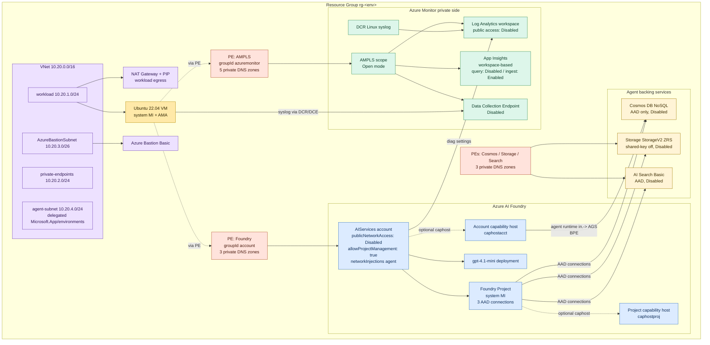

# Private Azure Monitor + Azure AI Foundry (gpt-4.1-mini) on Private Link

This repo deploys a **fully private** Azure Monitor and Azure AI Foundry stack into
a single resource group, using **Bicep + Azure Developer CLI (`azd`)**.

When you finish `azd up`:

- A Linux VM (no public IP, reachable only via Azure Bastion) sends syslog
  through the **Azure Monitor Agent** to a Log Analytics workspace whose
  **public ingestion and query are both disabled** — telemetry traverses an
  **Azure Monitor Private Link Scope (AMPLS)** via a private endpoint in your
  VNet.
- An **Azure AI Foundry** account (`publicNetworkAccess: Disabled`) hosts a
  **`gpt-4.1-mini`** model deployment, reachable from the same VNet through a
  second private endpoint. Foundry account diagnostics flow to the same
  (private) Log Analytics workspace.
- From the test VM you can resolve the Azure Monitor and Foundry hostnames to
  **private IPs**, send a test syslog event and see it queryable in Log
  Analytics, and call `gpt-4.1-mini` over the private endpoint using the VM's
  managed identity — and confirm that the **same Foundry call from outside the
  VNet fails**.

---

## Table of contents

- [Why this matters](#why-this-matters)
- [What gets deployed](#what-gets-deployed)
- [Prerequisites](#prerequisites)
- [Quickstart (`azd up`)](#quickstart-azd-up)
- [Configuration knobs](#configuration-knobs)
- [Connecting to the test VM via Bastion](#connecting-to-the-test-vm-via-bastion)
- [Verifying private DNS resolution](#verifying-private-dns-resolution)
- [Verifying Azure Monitor over Private Link](#verifying-azure-monitor-over-private-link)
- [Verifying Foundry / gpt-4.1-mini over Private Link](#verifying-foundry--gpt-41-mini-over-private-link)
- [Confirming public access really is blocked](#confirming-public-access-really-is-blocked)
- [Enabling Foundry Agents (Standard Setup)](#enabling-foundry-agents-standard-setup)
- [Optional hardening: AMPLS PrivateOnly mode](#optional-hardening-ampls-privateonly-mode)
- [Cost notes](#cost-notes)
- [Cleanup](#cleanup)
- [Troubleshooting](#troubleshooting)

### Companion docs

- 📘 **[`Networking.md`](./Networking.md)** — full network architecture
  reference (VNet/subnets, every PE, every DNS zone, AMPLS scoped
  resources, service-by-service "over private network?" table, public
  access posture).
- 🔐 **[`Bastion-VM-Access.md`](./Bastion-VM-Access.md)** — step-by-step
  guide for connecting to the locked-down VM and reaching the Foundry
  portal (`https://ai.azure.com`) through a SOCKS5 tunnel from your
  laptop browser. Includes FoxyProxy / Firefox / Edge / Chrome configs.
- 📊 **[`Foundry-Tracing.md`](./Foundry-Tracing.md)** — Foundry agent
  tracing wired to private App Insights. Explains the data path, how to
  verify the connection, query traces from the VM, and prove the
  laptop is locked out.

---

## Why this matters

### Azure Monitor Private Link Scope (AMPLS)

By default, the Azure Monitor Agent and Application Insights SDK send telemetry
over the **public internet** (encrypted with TLS, but still over public
networks). For regulated workloads — government, finance, healthcare, or any
"no public internet" policy — that's not acceptable.

**AMPLS** is a resource that groups one or more Azure Monitor resources (Log
Analytics workspaces, Application Insights components, Data Collection
Endpoints). You attach a **Private Endpoint** to the AMPLS, the PE gets a
private IP from your VNet, and private DNS zones redirect the Azure Monitor
hostnames to that private IP. Traffic stays on the Microsoft backbone.

There are two access-control axes that are easy to confuse:

1. **AMPLS `accessMode`** (`Open` vs `PrivateOnly`) — controls what networks
   reaching this AMPLS can do with *other* Azure Monitor resources that are not
   scoped into it. **It does not, by itself, close off public access to the
   scoped resources.**
2. **Resource-level `publicNetworkAccessFor*` flags** on the workspace and
   App Insights — these *do* close off public ingestion/query.

This repo sets the workspace to `publicNetworkAccessForIngestion: Disabled`
and `publicNetworkAccessForQuery: Disabled`. App Insights is set to
`publicNetworkAccessForQuery: Disabled` but **`publicNetworkAccessForIngestion: Enabled`** — this is a
deliberate exception so the Microsoft-managed runtime that executes
**prompt agents** can post OTel traces to App Insights. Prompt agents run
outside your VNet and cannot reach an AMPLS-private ingestion endpoint,
so locking ingestion breaks prompt-agent tracing entirely (verified
empirically). Query plane stays private — public KQL queries are denied
at the NSP. Full rationale and the no-tracing strict alternative are in
[`Foundry-Tracing.md`](./Foundry-Tracing.md). AMPLS itself is in `Open`
mode (parameterized — see [hardening](#optional-hardening-ampls-privateonly-mode)).

### Azure AI Foundry / `gpt-4.1-mini`

**Azure AI Foundry** is Azure's umbrella for first-party and partner AI models.
The underlying ARM resource is `Microsoft.CognitiveServices/accounts` of
`kind: AIServices`. Models like `gpt-4.1-mini` are deployed as child
`deployments` of that account.

`gpt-4.1-mini` is a small, cheap, fast OpenAI model — good for testing private
endpoint connectivity without burning much budget.

This repo creates the Foundry account with `publicNetworkAccess: Disabled`,
deploys `gpt-4.1-mini`, and attaches a private endpoint (group id `account`)
plus the three required private DNS zones. The result: the model is reachable
**only** from networks that go through that private endpoint.

---

## What gets deployed

Single resource group in your chosen region (default `eastus2`):



**Resources in detail:**

- **VNet 10.20.0.0/16** with 4 subnets: `workload` (10.20.1.0/24, VM NIC + NAT GW egress), `private-endpoints` (10.20.2.0/24, all 5 PEs), `AzureBastionSubnet` (10.20.3.0/26), `agent-subnet` (10.20.4.0/24, delegated to `Microsoft.App/environments` for Foundry Agent network injection).
- **NAT Gateway + public IP** attached to the workload subnet so the VM has outbound egress for cloud-init (`apt`, `curl https://aka.ms/InstallAzureCLIDeb`) and the AzureMonitorLinuxAgent extension. New VNets no longer get default outbound access.
- **Log Analytics workspace**, **workspace-based Application Insights**, **Data Collection Endpoint** — all with public ingestion **and** query access **Disabled**.
- **Data Collection Rule** (Linux syslog → workspace) + association on the VM.
- **AMPLS** (global) with `ingestionAccessMode`/`queryAccessMode` = `Open` (configurable to `PrivateOnly`), scoped to workspace + App Insights + DCE.
- **Private Endpoint → AMPLS** (groupId `azuremonitor`), DNS zone group containing 5 zones (`monitor`, `oms`, `ods`, `agentsvc`, `blob.<storage-suffix>`).
- **Azure AI Foundry account** (`AIServices`, `publicNetworkAccess: Disabled`, custom subdomain with a uniqueString hash, system MI, `allowProjectManagement: true`, `networkAcls.defaultAction: Deny`, `networkInjections` bound to the agent subnet).
- **`gpt-4.1-mini` model deployment** (GlobalStandard, configurable capacity).
- **Foundry Project** (sub-resource of the account) with system MI and three AAD connections (Cosmos / Storage / Search) ready for the agent capability host.
- **Foundry diagnostic settings** → Log Analytics workspace (audit/request/response/trace, all metrics).
- **Private Endpoint → Foundry** (groupId `account`), DNS zone group containing 3 zones (`cognitiveservices`, `openai`, `services.ai`).
- **Cosmos DB NoSQL account** (AAD-only, public access Disabled) — BYO thread store the capability host populates with the `enterprise_memory` database.
- **Storage account** (`StorageV2` ZRS, shared-key off, public access Disabled) — BYO blob store the capability host populates with per-project containers.
- **Azure AI Search** (Basic SKU, AAD, public access Disabled) — BYO vector store. Basic is the cheapest tier that supports private endpoints (Free does not).
- **Private Endpoints → Cosmos / Storage / Search** with 3 additional private DNS zones (`documents.azure.com`, `blob.<storage-suffix>`, `search.windows.net`).
- **Project-MI RBAC** on backing services (Cosmos DB Operator, Storage Blob Data Contributor, Search Index Data Contributor, Search Service Contributor) — pre-provisioned so flipping `ENABLE_AGENTS` on is a one-step change.
- **Capability hosts** (account `caphostacct` + project `caphostproj`) — only created when `ENABLE_AGENTS=true`. These turn the project into a working agent runtime and provision data-plane DBs / containers / indexes.
- **RBAC** on the VM's system-assigned MI:
  - **Cognitive Services OpenAI User** → Foundry account (required for `/openai/deployments/*/chat/completions` Entra auth — "Cognitive Services User" is not enough)
  - **Azure AI User** → Foundry project (for the `azure-ai-projects` SDK)
  - **Log Analytics Reader** → workspace (KQL via the data plane while public query access is disabled)
  - **Monitoring Reader** → resource group
- **Azure Bastion (Basic SKU)** + public IP for Portal-based SSH.
- **Ubuntu 22.04 VM** (Standard_B2ms, no public IP, system MI, AzureMonitorLinuxAgent, DCR association; cloud-init installs `azure-cli`, `curl`, `jq`, `dnsutils`).

> **Cost note:** Cosmos / Storage / AI Search are pre-provisioned by default so you can flip on agents with a single env var later. If you don't want the ~$80/mo baseline, set `ENABLE_AGENT_BACKING_SERVICES=false` before `azd up` and add them later.


---

## Prerequisites

- **Azure subscription** with permission to deploy at subscription scope
  (Owner, or Contributor + User Access Administrator). You need User Access
  Administrator because we create role assignments.
- **Azure CLI** `>= 2.60` — `brew install azure-cli` / [docs](https://learn.microsoft.com/cli/azure/install-azure-cli)
- **Azure Developer CLI** `>= 1.10` — `brew tap azure/azd && brew install azd` / [docs](https://learn.microsoft.com/azure/developer/azure-developer-cli/install-azd)
- **Bicep** (bundled with Azure CLI).
- **SSH keypair** — `ssh-keygen -t ed25519 -f ~/.ssh/id_ed25519`.
- **Quota for `gpt-4.1-mini`** in your chosen region. Check with:
  ```bash
  az cognitiveservices account list-skus --location eastus2 --kind AIServices -o table
  az cognitiveservices usage list --location eastus2 -o table
  ```
- **Resource providers** registered:
  ```bash
  az provider register -n Microsoft.Insights
  az provider register -n Microsoft.OperationalInsights
  az provider register -n Microsoft.CognitiveServices
  az provider register -n Microsoft.Network
  ```

---

## Quickstart (`azd up`)

```bash
# 1. Sign in
az login
azd auth login

# 2. Create an azd environment (this becomes the resource-name prefix)
#    NOTE: keep it lowercase letters/digits/hyphens; underscores are auto-
#    converted but other special chars may break the Foundry custom subdomain.
azd env new ampls-demo

# 3. Tell azd which region + your SSH public key
azd env set AZURE_LOCATION eastus2
azd env set SSH_PUBLIC_KEY "$(cat ~/.ssh/id_ed25519.pub)"

# (Optional overrides)
# azd env set ACCESS_MODE Open                      # or PrivateOnly
# azd env set ADMIN_USERNAME azureuser
# azd env set FOUNDRY_MODEL_NAME gpt-4.1-mini
# azd env set FOUNDRY_MODEL_VERSION 2025-04-14
# azd env set FOUNDRY_MODEL_SKU GlobalStandard
# azd env set FOUNDRY_MODEL_CAPACITY 10

# 4. Preview the deployment (recommended)
azd provision --preview

# 5. Deploy
azd up
```

`azd up` takes ~12–20 minutes (Bastion provisioning is the slow step).

When it finishes, azd will print outputs. You can also re-read them at any
time with `azd env get-values`. Key ones:

| Output                              | What it is |
|-------------------------------------|------------|
| `AZURE_RESOURCE_GROUP`              | RG containing everything |
| `BASTION_NAME`                      | Bastion to connect to the VM |
| `VM_NAME`, `VM_PRIVATE_IP`, `VM_ADMIN_USERNAME` | Test VM info |
| `LOG_ANALYTICS_WORKSPACE_NAME` / `_CUSTOMER_ID` | Workspace for KQL queries |
| `DCE_LOGS_INGESTION_ENDPOINT`       | Custom logs ingestion URL |
| `AMPLS_NAME`, `AMPLS_ACCESS_MODE`   | AMPLS resource + mode |
| `FOUNDRY_NAME`                      | Foundry / Cognitive Services account name |
| `FOUNDRY_OPENAI_ENDPOINT`           | `https://<subdomain>.openai.azure.com/` |
| `FOUNDRY_MODEL_DEPLOYMENT_NAME`     | e.g. `gpt-4.1-mini` |
| `FOUNDRY_PROJECT_NAME`              | Foundry project (sub-resource of the account) |
| `FOUNDRY_PROJECT_ENDPOINT`          | `https://<subdomain>.services.ai.azure.com/api/projects/<project>` |
| `AGENT_BACKING_ENABLED`             | `true` if Cosmos/Storage/Search were provisioned |
| `AGENTS_ENABLED`                    | `true` if the capability hosts were created |
| `COSMOS_DB_NAME`, `STORAGE_ACCOUNT_NAME`, `SEARCH_SERVICE_NAME` | Agent backing service names (empty when disabled) |

### One-shot verification script

Run this from your laptop after `azd up` to assert every piece is wired
correctly. Outputs are concise — anything not `Approved` / `Succeeded` /
`Disabled` should be investigated.

```bash
set -e
RG=$(azd env get-value AZURE_RESOURCE_GROUP)
FOUNDRY=$(azd env get-value FOUNDRY_NAME)
LAW=$(azd env get-value LOG_ANALYTICS_WORKSPACE_NAME)
VM=$(azd env get-value VM_NAME)
PROJECT=$(azd env get-value FOUNDRY_PROJECT_NAME)

echo "=== 1. Private endpoints (expect: Approved) ==="
az network private-endpoint list -g "$RG" \
  --query "[].{name:name, state:privateLinkServiceConnections[0].privateLinkServiceConnectionState.status}" -o table

echo "=== 2. Private DNS zones — A record counts (expect: >= 1 each) ==="
for z in privatelink.monitor.azure.com privatelink.oms.opinsights.azure.com \
         privatelink.ods.opinsights.azure.com privatelink.agentsvc.azure-automation.net \
         privatelink.cognitiveservices.azure.com privatelink.openai.azure.com \
         privatelink.services.ai.azure.com; do
  c=$(az network private-dns record-set a list -g "$RG" -z "$z" --query "length(@)" -o tsv 2>/dev/null || echo 0)
  echo "  $z : $c"
done

echo "=== 3. Foundry account state (expect: publicNetworkAccess=Disabled, allowProjectManagement=true) ==="
az cognitiveservices account show -g "$RG" -n "$FOUNDRY" \
  --query "{name:name, public:properties.publicNetworkAccess, projects:properties.allowProjectManagement, state:properties.provisioningState}" -o table

echo "=== 4. Foundry model deployments ==="
az cognitiveservices account deployment list -g "$RG" -n "$FOUNDRY" \
  --query "[].{name:name, model:properties.model.name, version:properties.model.version, sku:sku.name}" -o table

echo "=== 5. Foundry project (expect: Succeeded) ==="
az rest --method get --url \
  "https://management.azure.com$(az cognitiveservices account show -g $RG -n $FOUNDRY --query id -o tsv)/projects/$PROJECT?api-version=2025-04-01-preview" \
  --query "{name:name, state:properties.provisioningState, mi:identity.principalId}" -o table

echo "=== 6. Workspace public access (expect: Disabled for both) ==="
az monitor log-analytics workspace show -g "$RG" -n "$LAW" \
  --query "{ingestion:publicNetworkAccessForIngestion, query:publicNetworkAccessForQuery}" -o table

echo "=== 7. VM MI role assignments ==="
VM_MI=$(az vm show -g "$RG" -n "$VM" --query "identity.principalId" -o tsv)
az role assignment list --assignee "$VM_MI" --all \
  --query "[].{role:roleDefinitionName, scope:scope}" -o table

if [ "$(azd env get-value AGENT_BACKING_ENABLED)" = "true" ]; then
  echo "=== 8. Backing services public access (expect: Disabled) ==="
  COSMOS=$(azd env get-value COSMOS_DB_NAME)
  STORAGE=$(azd env get-value STORAGE_ACCOUNT_NAME)
  SEARCH=$(azd env get-value SEARCH_SERVICE_NAME)
  echo -n "  Cosmos:  "; az cosmosdb show -g "$RG" -n "$COSMOS"  --query "publicNetworkAccess" -o tsv
  echo -n "  Storage: "; az storage account show -g "$RG" -n "$STORAGE" --query "publicNetworkAccess" -o tsv
  echo -n "  Search:  "; az search service show -g "$RG" -n "$SEARCH" --query "publicNetworkAccess" -o tsv

  echo "=== 9. Foundry project connections (expect: 3 entries, all AAD) ==="
  SUB=$(az account show --query id -o tsv)
  az rest --method get --url \
    "https://management.azure.com/subscriptions/$SUB/resourceGroups/$RG/providers/Microsoft.CognitiveServices/accounts/$FOUNDRY/projects/$PROJECT/connections?api-version=2025-04-01-preview" \
    --query "value[].{name:name,category:properties.category,auth:properties.authType}" -o table

  echo "=== 10. Project MI RBAC on backing services ==="
  PROJ_MI=$(az rest --method get --url \
    "https://management.azure.com/subscriptions/$SUB/resourceGroups/$RG/providers/Microsoft.CognitiveServices/accounts/$FOUNDRY/projects/$PROJECT?api-version=2025-04-01-preview" \
    --query "identity.principalId" -o tsv)
  az role assignment list --assignee "$PROJ_MI" --all \
    --query "[].{role:roleDefinitionName, scope:scope}" -o table
fi

if [ "$(azd env get-value AGENTS_ENABLED)" = "true" ]; then
  echo "=== 11. Capability hosts (expect: Succeeded) ==="
  SUB=$(az account show --query id -o tsv)
  az rest --method get --url \
    "https://management.azure.com/subscriptions/$SUB/resourceGroups/$RG/providers/Microsoft.CognitiveServices/accounts/$FOUNDRY/capabilityHosts/caphostacct?api-version=2025-04-01-preview" \
    --query "{name:name,state:properties.provisioningState}" -o table
  az rest --method get --url \
    "https://management.azure.com/subscriptions/$SUB/resourceGroups/$RG/providers/Microsoft.CognitiveServices/accounts/$FOUNDRY/projects/$PROJECT/capabilityHosts/caphostproj?api-version=2025-04-01-preview" \
    --query "{name:name,state:properties.provisioningState,thread:properties.threadStorageConnections,storage:properties.storageConnections,vector:properties.vectorStoreConnections}" -o jsonc
fi
```

Expected highlights:
- Every PE shows `Approved`.
- Every DNS zone has ≥ 1 A record pointing to a `10.20.2.x` address.
- Foundry: `Disabled` / `true` / `Succeeded`.
- Project: `Succeeded` and a non-empty `mi` (system-assigned principal id).
- Workspace: both ingestion and query are `Disabled`.
- VM MI has 4 roles: Cognitive Services OpenAI User, Azure AI User, Log
  Analytics Reader, Monitoring Reader.

---

## Configuration knobs

Set these *before* `azd up` (or `azd provision` again to change them):

| `azd env set` key      | Default          | Notes |
|------------------------|------------------|-------|
| `AZURE_LOCATION`       | (required)       | e.g. `eastus2` |
| `SSH_PUBLIC_KEY`       | (required)       | Contents of `~/.ssh/id_rsa.pub` or similar |
| `ACCESS_MODE`          | `Open`           | AMPLS access mode. `PrivateOnly` is stricter (see below) |
| `ADMIN_USERNAME`       | `azureuser`      | Linux admin user on the test VM |
| `FOUNDRY_MODEL_NAME`   | `gpt-4.1-mini`   | |
| `FOUNDRY_MODEL_VERSION`| `2025-04-14`     | Pin to a model version |
| `FOUNDRY_MODEL_SKU`    | `GlobalStandard` | `Standard` if you want region-pinned |
| `FOUNDRY_MODEL_CAPACITY`| `10`            | Thousands of TPM. Increase if you hit quota |
| `ENABLE_AGENT_BACKING_SERVICES` | `true` | Pre-provision Cosmos + Storage + Search + PEs + connections. Set `false` to skip and save ~$80/mo. |
| `ENABLE_AGENTS`        | `false`          | Create the account + project capability hosts. Requires `ENABLE_AGENT_BACKING_SERVICES=true`. |
| `SEARCH_SKU`           | `basic`          | `basic` is the cheapest tier that supports private endpoints (Free does not). |

---

## Connecting to the test VM via Bastion

The VM has **no public IP** — Bastion is the only ingress path. For a
beginner-friendly walkthrough that covers both the simple browser-based
SSH and a SOCKS5 tunnel that lets you reach the Foundry portal
(`https://ai.azure.com`) from your laptop browser, see:

📖 **[`Bastion-VM-Access.md`](./Bastion-VM-Access.md)** — full step-by-step
guide with troubleshooting, FoxyProxy/Firefox/Chrome configuration, and
cost notes.

Quick summary:

| Goal | Path | Bastion SKU |
|---|---|---|
| One-off shell on the VM, then `curl`/CLI to test Foundry | Portal → VM → *Connect via Bastion* | Basic (default) |
| Browse `https://ai.azure.com` from your laptop with full UI | `az network bastion tunnel` + `ssh -D` SOCKS5 | Standard (one-line upgrade) |

You'll need your SSH **private** key (`~/.ssh/id_ed25519`) for either
path. The Bastion dialog and the `ssh` command both consume the same key.

---

## Verifying private DNS resolution

Once you're SSHed into the VM via Bastion, confirm that the Azure Monitor and
Foundry hostnames now resolve to **private IPs in `10.20.2.x`** instead of
public IPs.

```bash
# Pull values into shell variables (we set these as azd outputs)
WORKSPACE_ID=<LOG_ANALYTICS_WORKSPACE_CUSTOMER_ID>   # GUID
FOUNDRY_HOST=<FOUNDRY_OPENAI_ENDPOINT host>          # e.g. ampls-demo-aif-xyz.openai.azure.com

# Azure Monitor — these should all return 10.20.2.x
dig +short ${WORKSPACE_ID}.ods.opinsights.azure.com
dig +short ${WORKSPACE_ID}.oms.opinsights.azure.com
dig +short ${WORKSPACE_ID}.agentsvc.azure-automation.net

# Foundry — both should return 10.20.2.x
dig +short ${FOUNDRY_HOST}
dig +short $(echo $FOUNDRY_HOST | sed 's/openai/cognitiveservices/')
```

If any of these still return a public IP, see [Troubleshooting](#troubleshooting).

---

## Verifying Azure Monitor over Private Link

The AMA was installed by the Bicep `AzureMonitorLinuxAgent` extension, and a
DCR association was created. Generate a test syslog event from the VM:

```bash
logger -t ampls-test "hello from private link $(date -u +%FT%TZ)"
```

Wait ~1–2 minutes for ingestion, then query the workspace **from the VM**
(Portal Logs queries from outside the VNet will fail because public access is
disabled):

```bash
# Authenticate the az CLI to the VM's managed identity
az login --identity

# Query the workspace
az monitor log-analytics query \
  --workspace <LOG_ANALYTICS_WORKSPACE_CUSTOMER_ID> \
  --analytics-query 'Syslog | where ProcessName == "ampls-test" | take 50' \
  -o table
```

You should see your `hello from private link ...` message.

### Confirm the Private Endpoint connection is Approved

From your laptop (not the VM):

```bash
az network private-endpoint show \
  --name <namePrefix>-ampls-pe \
  --resource-group <AZURE_RESOURCE_GROUP> \
  --query "privateLinkServiceConnections[0].privateLinkServiceConnectionState.status" \
  -o tsv
# → Approved
```

---

## Verifying Foundry / gpt-4.1-mini over Private Link

From **inside** the VM (where DNS resolves to the private IP), grab a managed-
identity token and call the chat completions endpoint:

```bash
FOUNDRY=<FOUNDRY_OPENAI_ENDPOINT>             # e.g. https://...openai.azure.com/
DEPLOYMENT=<FOUNDRY_MODEL_DEPLOYMENT_NAME>    # e.g. gpt-4.1-mini

TOKEN=$(curl -s -H "Metadata: true" \
  "http://169.254.169.254/metadata/identity/oauth2/token?api-version=2018-02-01&resource=https://cognitiveservices.azure.com" \
  | jq -r .access_token)

curl -sS -X POST \
  "${FOUNDRY}openai/deployments/${DEPLOYMENT}/chat/completions?api-version=2024-10-21" \
  -H "Authorization: Bearer $TOKEN" \
  -H "Content-Type: application/json" \
  -d '{
    "messages": [
      {"role":"system","content":"You are a terse private-link test."},
      {"role":"user","content":"Say hello and confirm you ran over a private endpoint."}
    ],
    "max_tokens": 50
  }' | jq .
```

You should see a normal chat-completions response.

### See the Foundry traces in Log Analytics

Foundry account diagnostics (RequestResponse, Trace, Audit, AllMetrics) are
sent to the Log Analytics workspace. From the VM:

```bash
az monitor log-analytics query \
  --workspace <LOG_ANALYTICS_WORKSPACE_CUSTOMER_ID> \
  --analytics-query 'AzureDiagnostics
    | where ResourceProvider == "MICROSOFT.COGNITIVESERVICES"
    | project TimeGenerated, OperationName, ResultType, durationMs=DurationMs
    | order by TimeGenerated desc
    | take 20' \
  -o table
```

---

## Confirming public access really is blocked

This is the part that proves your private-link setup actually works.

From your **laptop** (or anything outside the VNet):

```bash
# Use the FOUNDRY_OPENAI_ENDPOINT output (which contains the unique custom
# subdomain), not just the FOUNDRY_NAME.
FOUNDRY_OAI=<FOUNDRY_OPENAI_ENDPOINT>   # e.g. https://ampls-demo-aif-xyz.openai.azure.com/

# 1. Foundry over its public hostname should fail (DNS may still resolve to
#    public IP because your laptop doesn't use the private DNS zones, but the
#    service-side firewall rejects the call):
curl -i "${FOUNDRY_OAI}openai/deployments/gpt-4.1-mini/chat/completions?api-version=2024-10-21" \
  -H "api-key: anything" \
  -d '{}'
# → HTTP/2 403 ... PublicNetworkAccess is disabled

# 2. Log Analytics ingestion over public hostname should also be rejected;
#    the easiest way to see it is to try a query from the Portal Logs blade
#    while NOT on a network that resolves the workspace to a private IP —
#    you'll get a "public network access for query is disabled" error.
```

If you see those rejections, the setup is doing exactly what it should.

---

## Enabling Foundry Agents (Standard Setup)

The default deployment pre-provisions everything the Foundry **Agents**
runtime needs — the BYO Cosmos / Storage / Search trio, their private
endpoints, the project's three AAD connections, and the project-MI RBAC on
each backing service — but it does **not** create the capability hosts.
Capability hosts are what turn a project into a working agent runtime; they
also start charging meter time on the data plane.

This split lets you stage cost: stand the platform up once, then enable
agents on demand.

### Turn agents on

```bash
azd env set ENABLE_AGENTS true
azd provision
```

That creates two resources:

- `Microsoft.CognitiveServices/accounts/capabilityHosts` named **`caphostacct`** — bootstraps the account's agent runtime against the delegated `agent-subnet`.
- `Microsoft.CognitiveServices/accounts/projects/capabilityHosts` named **`caphostproj`** — binds the project's three connections (vector / blob / thread) to that runtime.

It also assigns two post-caphost roles that can only be granted once the
agent runtime has created its data-plane DBs / containers:

- **Storage Blob Data Owner** on the storage account (ABAC-conditioned to per-project agent containers only)
- **Cosmos DB Built-in Data Contributor** on the `enterprise_memory` database (data-plane `sqlRoleAssignment`)

> **First-deploy 403?** Bicep's `dependsOn` waits for ARM accept, not
> data-plane RBAC propagation. If `caphost` provisioning errors with a 403
> on the first run, wait ~60 seconds and re-run `azd provision` — Bicep is
> idempotent and the second pass succeeds.

### Verify agents

```bash
RG=$(azd env get-value AZURE_RESOURCE_GROUP)
ACCT=$(azd env get-value FOUNDRY_NAME)
PROJ=$(azd env get-value FOUNDRY_PROJECT_NAME)
SUB=$(az account show --query id -o tsv)

# Account capability host
az rest --method get --url \
  "https://management.azure.com/subscriptions/$SUB/resourceGroups/$RG/providers/Microsoft.CognitiveServices/accounts/$ACCT/capabilityHosts/caphostacct?api-version=2025-04-01-preview" \
  --query "{name:name,kind:properties.capabilityHostKind,state:properties.provisioningState}" -o table

# Project capability host (with the 3 connection bindings)
az rest --method get --url \
  "https://management.azure.com/subscriptions/$SUB/resourceGroups/$RG/providers/Microsoft.CognitiveServices/accounts/$ACCT/projects/$PROJ/capabilityHosts/caphostproj?api-version=2025-04-01-preview" \
  --query "{name:name,kind:properties.capabilityHostKind,state:properties.provisioningState,thread:properties.threadStorageConnections,storage:properties.storageConnections,vector:properties.vectorStoreConnections}" -o jsonc
```

Both should report `provisioningState: Succeeded`. The project caphost's
`thread`, `storage`, and `vector` arrays should contain the three
connection names that match the connection resources on the project
(`<cosmos>-connection`, `<storage>-connection`, `<search>-connection`).

### Turn agents off

```bash
azd env set ENABLE_AGENTS false
azd provision
```

Bicep won't delete the capability hosts that already exist (conditional
resources are skip-on-false in `azd provision`). To actually remove them,
issue the explicit DELETE calls shown in the [Cleanup](#cleanup) section
or set `ENABLE_AGENTS=false` and run `azd down`.

> **Skip backing services entirely?** Set
> `azd env set ENABLE_AGENT_BACKING_SERVICES false` before the first
> `azd up` if you want to skip Cosmos / Storage / Search (saves ~$80/mo
> baseline). You can flip it on later — be aware Bicep will add new
> resources but won't tear down the older PE-less Foundry account in
> place, so it's smoother to make this choice up front.

---

## Optional hardening: AMPLS `PrivateOnly` mode

`PrivateOnly` makes networks connected through this AMPLS unable to reach
*any* Azure Monitor resource that is **not** in the AMPLS — useful if you want
to guarantee no telemetry leaks to other workspaces or App Insights instances
that happen to share DNS in the VNet.

Before flipping, make sure every Azure Monitor resource your VNet talks to is
in the AMPLS. Then:

```bash
azd env set ACCESS_MODE PrivateOnly
azd up
```

The change applies to AMPLS only; the resource-level public-access flags on
the workspace are `Disabled` for both planes, and App Insights `Disabled`
for query (ingestion is intentionally `Enabled` for Foundry tracing — see
[`Foundry-Tracing.md`](./Foundry-Tracing.md)).

---

## Cost notes (rough, US prices, daily)

| Resource | Approx cost/day |
|----------|-----------------|
| Azure Bastion Basic | ~$5 |
| Azure Bastion Standard (if upgraded for SOCKS tunneling) | ~$7.50 |
| Standard public IP (Bastion + NAT GW) | ~$0.20 |
| Standard_B2ms VM (running) | ~$1.20 |
| Standard_B2ms VM (deallocated) | $0 (compute) — keep OS disk only ~$0.05 |
| Log Analytics ingestion | $0 (well under free tier for syslog test) |
| 5 × Private Endpoints | ~$1.20 |
| 11 × Private DNS zones | ~$0.18 |
| NAT Gateway | ~$1.10 (per hour + data) |
| AMPLS resource itself | $0 |
| Foundry account itself | $0 |
| `gpt-4.1-mini` tokens | Pay-per-token (cents for these tests) |
| **Agent backing services** (when `ENABLE_AGENT_BACKING_SERVICES=true`) | |
| AI Search Basic (1 replica × 1 partition) | ~$2.50 |
| Cosmos DB NoSQL (provisioned, idle baseline) | ~$0.80 |
| Storage StorageV2 ZRS (idle) | < $0.05 |

Total: **~$6–7/day** without agent backing services, **~$10/day** with them
(idle), more once you turn on `ENABLE_AGENTS` and start running agent
workloads. Tear down when not in use ([Cleanup](#cleanup)).

---

## Cleanup

### Pause (keep infra, save on VM compute)

If you'll come back to this deployment within a few days, just deallocate
the VM — keep Bastion + PEs in place. Compute charges stop; the OS disk
keeps your VM customizations.

```bash
az vm deallocate -g "$(azd env get-value AZURE_RESOURCE_GROUP)" \
  -n "$(azd env get-value VM_NAME)" --no-wait
```

To resume: `az vm start ...` and re-run the Bastion / SOCKS tunnels from
[`Bastion-VM-Access.md`](./Bastion-VM-Access.md).

Note: Bastion itself bills by the hour whether the VM is running or not.
For maximum savings on a long pause, also downgrade Bastion to Basic, or
delete + recreate it with `azd provision` next time.

### Full teardown

```bash
# If you turned on agents, delete the project capability host FIRST.
# Foundry blocks RG deletion otherwise.
if [ "$(azd env get-value AGENTS_ENABLED 2>/dev/null)" = "true" ]; then
  RG=$(azd env get-value AZURE_RESOURCE_GROUP)
  ACCT=$(azd env get-value FOUNDRY_NAME)
  PROJ=$(azd env get-value FOUNDRY_PROJECT_NAME)
  az rest --method delete --url \
    "https://management.azure.com/subscriptions/$(az account show --query id -o tsv)/resourceGroups/$RG/providers/Microsoft.CognitiveServices/accounts/$ACCT/projects/$PROJ/capabilityHosts/caphostproj?api-version=2025-04-01-preview"
  az rest --method delete --url \
    "https://management.azure.com/subscriptions/$(az account show --query id -o tsv)/resourceGroups/$RG/providers/Microsoft.CognitiveServices/accounts/$ACCT/capabilityHosts/caphostacct?api-version=2025-04-01-preview"
fi

azd down --purge --force
```

`--purge` is important — it permanently deletes the soft-deleted Cognitive
Services account so you can redeploy with the same name later.

---

## Troubleshooting

**`gpt-4.1-mini` deployment fails with quota error.**
Increase `FOUNDRY_MODEL_CAPACITY` to a lower number, switch to a region with
more capacity, or request a quota increase:
[Quotas docs](https://learn.microsoft.com/azure/ai-foundry/openai/quotas-limits).

**`dig` from the VM still returns a public IP for `*.openai.azure.com` /
`*.ods.opinsights.azure.com`.**
Check the private DNS zone groups exist on the PEs and that the VNet has
links to all 8 zones:
```bash
az network private-endpoint dns-zone-group list \
  -g <rg> --endpoint-name <namePrefix>-ampls-pe -o table
az network private-endpoint dns-zone-group list \
  -g <rg> --endpoint-name <namePrefix>-foundry-pe -o table
az network private-dns link vnet list -g <rg> --zone-name privatelink.openai.azure.com -o table
```

**`logger` runs but nothing shows up in Log Analytics after a few minutes.**
- Check AMA is running: `systemctl status azuremonitoragent`
- Check the DCR association exists:
  `az monitor data-collection rule association list --resource <vm-id> -o table`
- Check the PE connection is `Approved` (see above).

**Foundry `curl` from the VM returns 403 `PublicNetworkAccess is disabled`.**
DNS is still resolving the Foundry hostname to the public IP. Re-check
`dig +short <FOUNDRY_HOST>` — it must return `10.20.2.x`. If not, the
Foundry PE's DNS zone group is missing or the VNet link to
`privatelink.openai.azure.com` / `privatelink.cognitiveservices.azure.com`
isn't in place.

**Foundry `curl` from the VM returns 401.**
Either the managed-identity token request failed (`echo $TOKEN`) or the role
assignment hasn't propagated yet. Wait 1–2 minutes and retry. You can also
check:
```bash
az role assignment list --assignee <VM_PRINCIPAL_ID> --all -o table
```
Required role on the Foundry account: **Cognitive Services OpenAI User**
(`5e0bd9bd-7b93-4f28-af87-19fc36ad61bd`). "Cognitive Services User" alone is
*not* sufficient for the `/openai/deployments/*/chat/completions` endpoint.

**Bastion connection hangs or "deployment failed for AzureBastionSubnet".**
The subnet must be **exactly** named `AzureBastionSubnet` and have prefix
length `/26` or larger. Both are set correctly in `infra/modules/network.bicep`.

**`azd down` fails to delete the Cognitive Services account.**
Soft-deleted Cognitive Services accounts block name reuse. Purge manually:
```bash
az cognitiveservices account purge -g <rg> -n <FOUNDRY_NAME> -l eastus2
```

---

## Repo layout

```
azure.yaml                   # azd project config
infra/
  main.bicep                 # subscription-scope entry; creates RG, composes modules
  main.parameters.json       # azd → Bicep parameter wiring
  modules/
    network.bicep            # VNet + 3 subnets + workload NSG
    monitoring.bicep         # Log Analytics + App Insights + DCE + DCR
    ampls.bicep              # AMPLS + scoped resources
    ampls-private-endpoint.bicep  # AMPLS PE + 5 DNS zones + zone group
    foundry.bicep            # Foundry account + gpt-4.1-mini + diagnostics + networkInjections
    foundry-private-endpoint.bicep # Foundry PE + 3 DNS zones + zone group
    foundry-project.bicep    # Project sub-resource + 3 AAD connections
    cosmos.bicep             # BYO Cosmos NoSQL (agent thread store)
    storage.bicep            # BYO Storage StorageV2 ZRS (agent blob store)
    search.bicep             # BYO AI Search Basic (agent vector store)
    backing-private-endpoints.bicep # 3 PEs + 3 DNS zones for the BYO trio
    agent-rbac.bicep         # Project MI roles on backing services
    caphost.bicep            # Conditional: account + project capability hosts
    bastion.bicep            # Bastion + public IP
    vm.bicep                 # Ubuntu VM + AMA + DCR association
    rbac.bicep               # VM MI role assignments
```
